# Grafana Installation and Dashboard Creation for Ubuntu Server Performance

## Overview
This documentation covers the installation of Grafana on an Ubuntu server, configuration of Azure Monitor agent, and creation of a performance monitoring dashboard.

## Prerequisites
- Ubuntu server (version 18.04 or later)
- Azure account with appropriate permissions
- Basic Linux CLI knowledge

## Task Progress

### Task 1: Prepare Ubuntu Server
- [x] Update and upgrade system packages

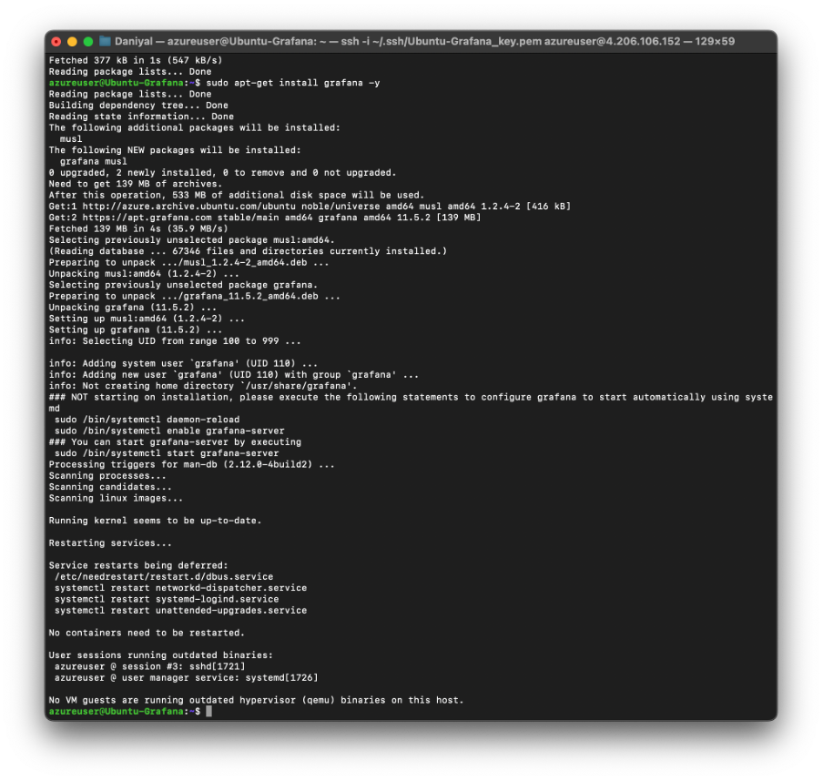

### Task 2: Install Grafana
- [x] Add Grafana's APT repository


- [x] Install Grafana
- [x] Start and enable Grafana server
- [x] Verify service status

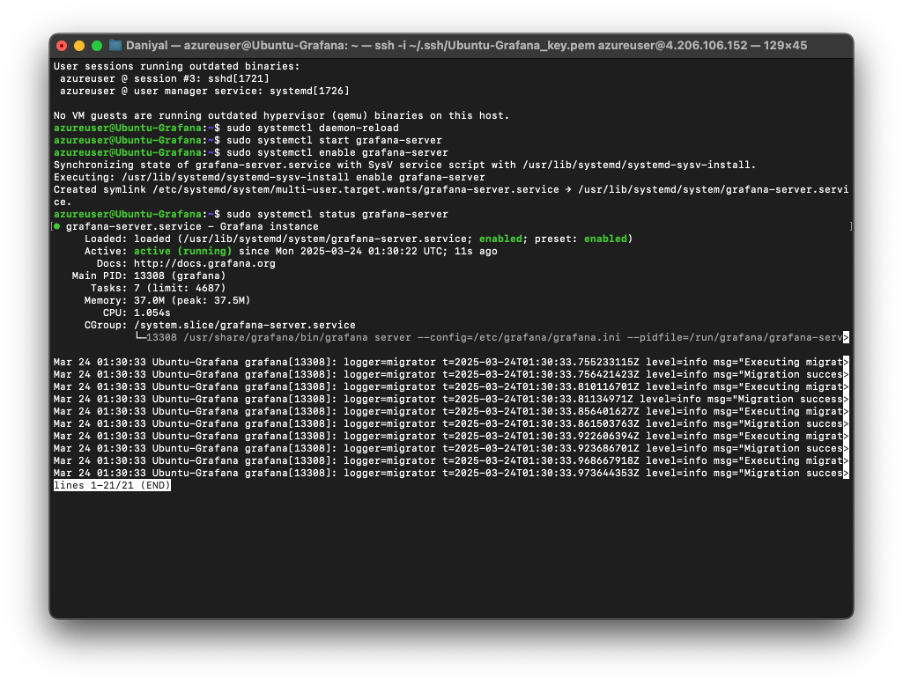

- [x] Enable port 3000

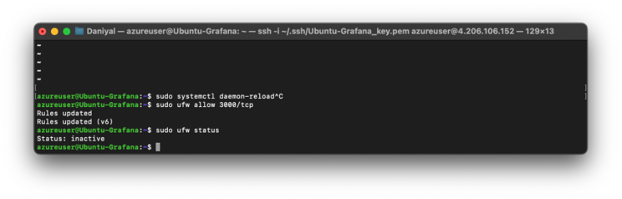


### Task 3: Connect Grafana to Azure Monitor
- [x] Enable Managed Identity for VM
- [x] Configure necessary roles
- [x] Configure grafana.ini

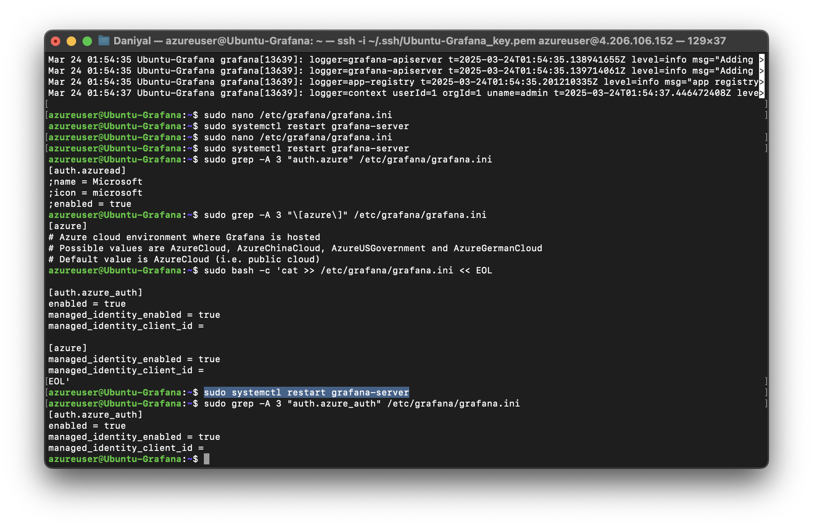

- [x] Set up Azure Monitor data source

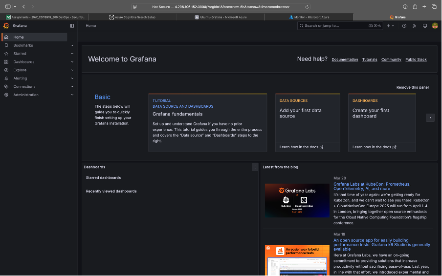
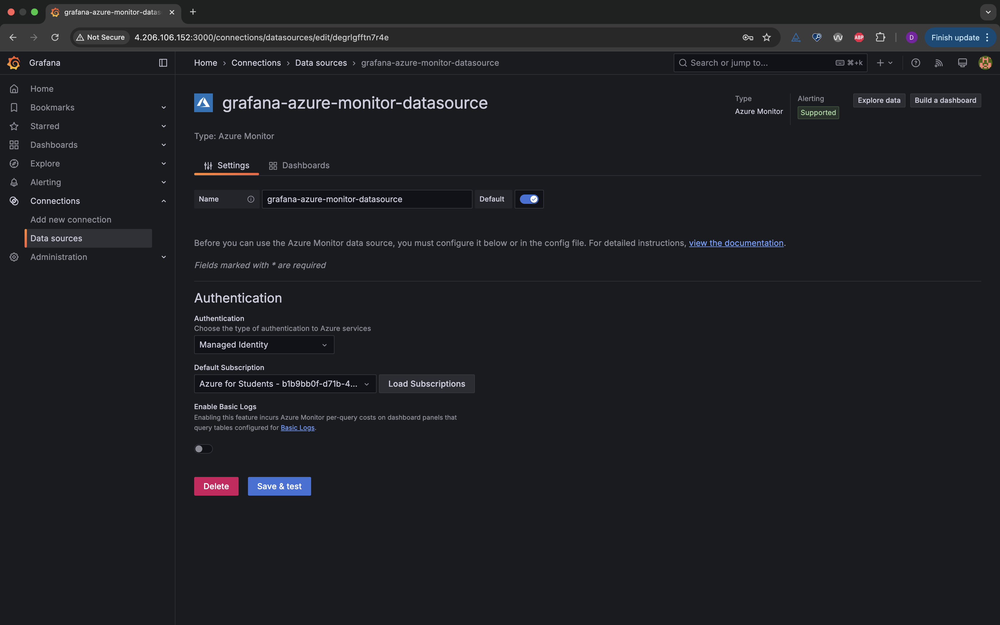


### Task 4: Create Dashboard
- [x] Create new dashboard

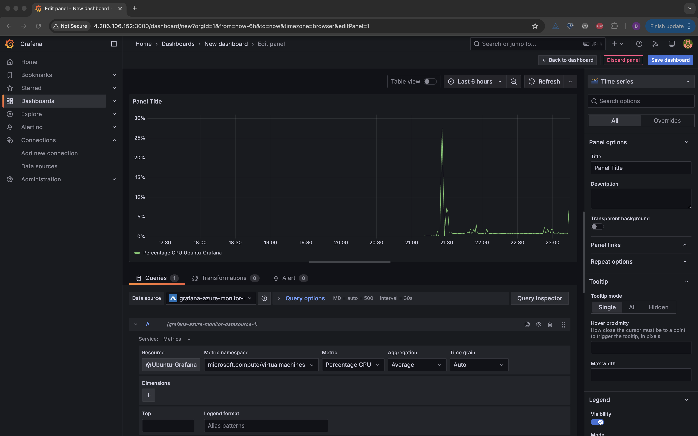

- [x] Add CPU metrics panel

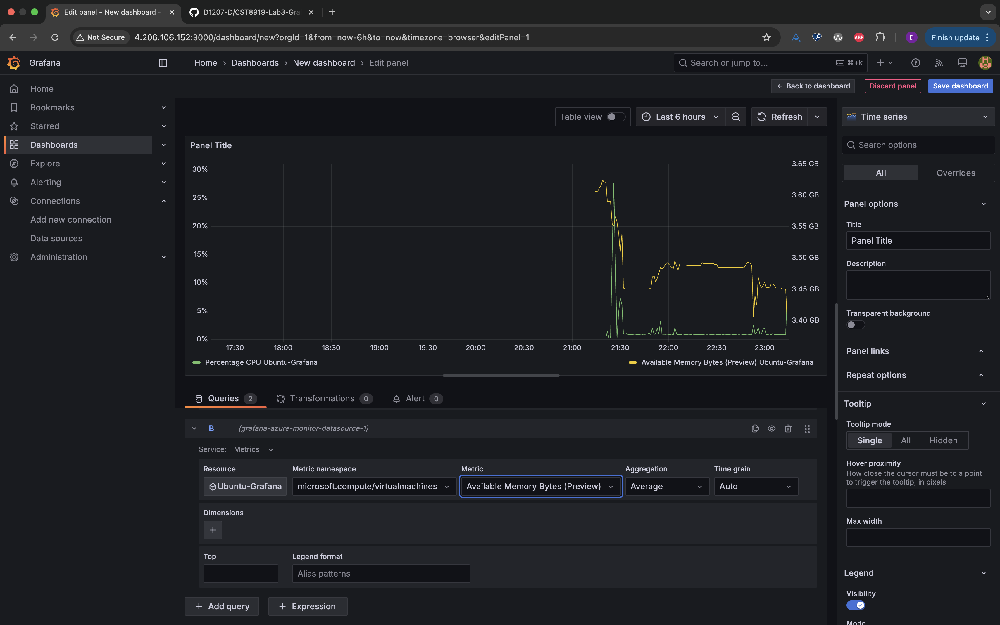

- [ ] Add memory metrics panel

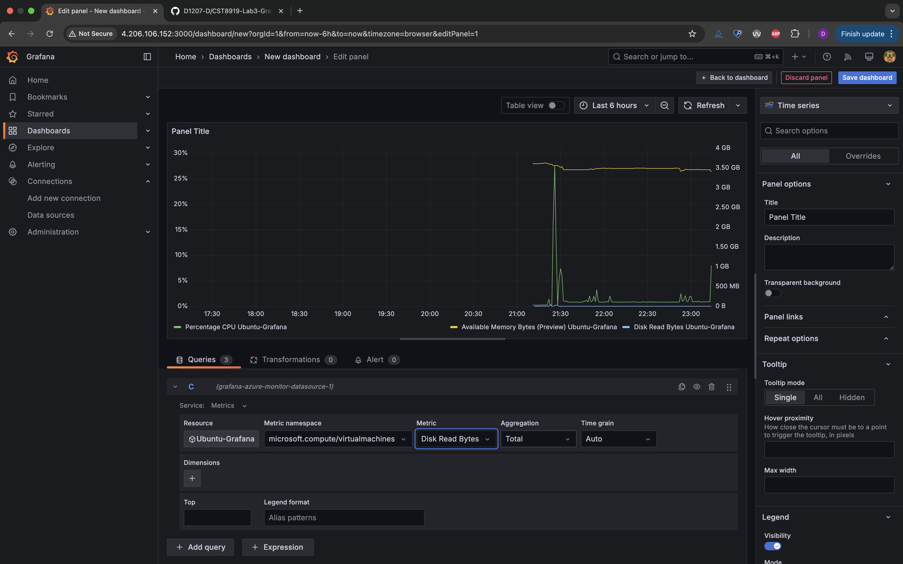

- [ ] Add disk I/O panel

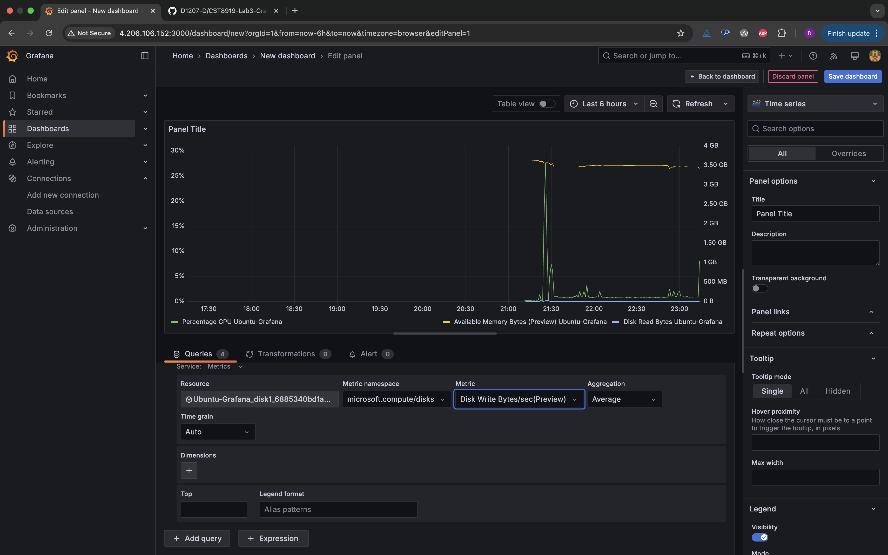


- [ ] Save and test dashboard

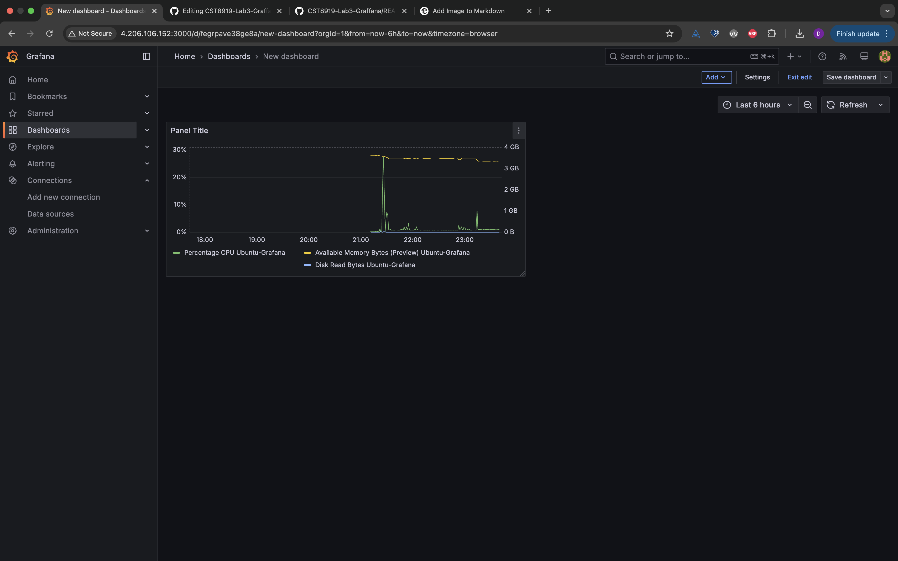


## Issues and Solutions

### 1. Azure VM Creation Issues
- **Issue**: Initial attempts to create VM failed due to subscription restrictions on VM sizes
- **Solution**: Used existing VM in the subscription instead

### 2. Managed Identity Authentication
- **Issue**: Managed Identity option not showing in Grafana Azure Monitor authentication
- **Solution**: Added required configuration to `/etc/grafana/grafana.ini`:
  ```ini
  [auth.azure_auth]
  enabled = true
  managed_identity_enabled = true
  managed_identity_client_id =

  [azure]
  managed_identity_enabled = true
  managed_identity_client_id =
  ```

### 3. Missing Metrics in Azure Monitor
- **Issue**: Metrics not showing up in Grafana dashboard
- **Solution**: 
  - Installed Azure Monitor Agent on VM
  - Enabled guest metrics through Azure Portal
  - Configured proper permissions (Reader and Monitoring Reader roles)

## Conclusion

This lab successfully demonstrated the integration of Grafana with Azure Monitor for comprehensive server monitoring. Key achievements include:

1. **Infrastructure Setup**
   - Successfully configured Ubuntu server with Grafana
   - Implemented secure authentication using Azure Managed Identity

2. **Monitoring Integration**
   - Established connection between Grafana and Azure Monitor
   - Configured proper metrics collection using Azure Monitor Agent
   - Set up essential performance monitoring dashboards

3. **Best Practices Implemented**
   - Used managed identities for secure authentication
   - Implemented proper role-based access control
   - Created organized, readable dashboard layouts

This implementation provides a foundation for monitoring server performance metrics and can be extended with additional panels and alerts as needed.


